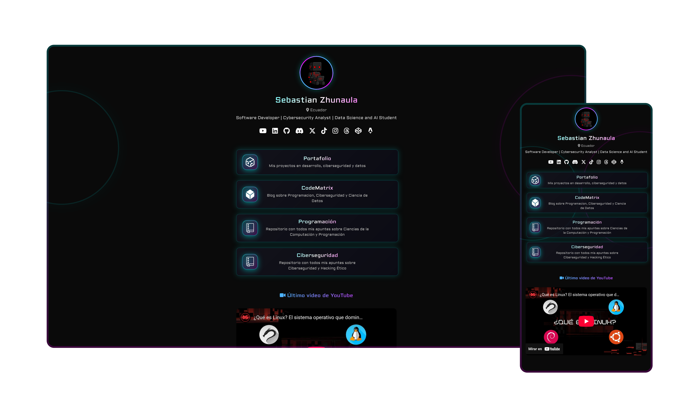

# 🔗 DevLinks44 – Personal Links Page

<p align="center">
  
</p>

**DevLinks44** is a *Linktree*-style web page developed with **Astro**, designed to centralize all your professional links in one place.  
Ideal for sharing your portfolio, social networks, technical blog, and featured projects.

---

## 🌐 Website

👉 [https://devlinks44.netlify.app](https://devlinks44.netlify.app)

---

## 🧩 Features

- 🎯 Clean and responsive design
- ⚡️ Fast loading thanks to Astro
- 🌍 Links to GitHub, blog, portfolio, courses, and social networks
- 🖼️ Custom icons and adaptable style
- 📁 Modular organization with reusable components

---

## 🚀 Local Installation

```bash
git clone https://github.com/Devsebastian44/DevLinks.git
cd DevLinks
npm install
npm run dev
```

Then open `http://localhost:4321` in your browser.

---

## 📂 Project Structure

```
DevLinks/
│── src/
│   ├── assets/               # Visual resources
│   ├── components/           # Astro components (buttons, sections)
│   ├── layouts/              # Main template
│   ├── pages/
│   │   └── index.astro       # Main links page
│   ├── styles/               # Custom CSS styles
```

---

## 📜 License

This project is licensed under **MIT**.  
You are free to use it for educational and personal purposes.